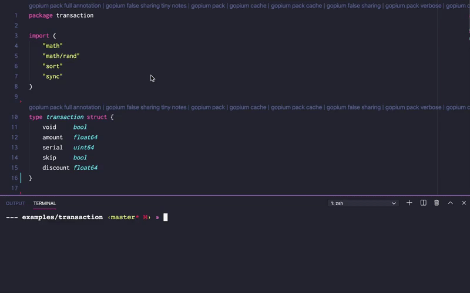

<p align="center">
    
</p>

# Gopium 🌺: Smart Go Structures Optimizer and Manager

[](https://github.com/1pkg/gopium/actions?query=workflow%3Alint+branch%3Amaster+)
[](https://github.com/1pkg/gopium/actions?query=workflow%3Abuild+branch%3Amaster+)
[](https://github.com/1pkg/gopium/actions?query=workflow%3Atest+branch%3Amaster+)
[](https://goreportcard.com/report/github.com/1pkg/gopium)
[](https://github.com/1pkg/gopium/blob/master/go.mod)
[](LICENSE)

## Introduction

Gopium is the tool that was designed to automate and simplify common structs performance and optimization transformations and fields management.

## Features

- Gopium provides numbers of common transformations for structs, such as: cpu cache alignment, memory packing, false sharing guarding, [and more](cmd/gopium/README.MD#strategies-and-transformations).
- All Gopium transformations could be combined together to build optimal actions for your specific code and needs.

```bash
gopium walker package strategy_1 strategy_2 strategy_3 ...
```

- All Gopium transformations results and artifacts could be differently formatted and routed to multiple outputs, among which are: direct overwriting or copying to go (code) ast, multiple options for code formatting and printing, comparison tables for results, common textual data serialization formats, [and more](cmd/gopium/README.MD#walkers-and-formatters).
- Gopium has rich vscode extension to provide better experience for usage and simplify interactions with tool, [see more](cmd/vscode/README.MD).
  
- Gopium supports target configs variety, in case if you need optimizations for specific platform or hardware, such as: target compiler, target architecture, target cpu cache lines sizes, [and more](cmd/gopium/README.MD#options-and-flags).
- Gopium has optional go structs tag literals to keep and reproduce gopium transformations inside your code base, also tags are intended to be used as structs fields grouping mechanism if you need to apply different transformation to different fields groups inside one structure, [see more](cmd/gopium/README.MD#strategies-and-transformations).

## Requirements Installation and Usage

Gopium was testsed on go1.13 and go1.14, but it's most likely gonna work with other versions too.  
Note that Gopium is heavily relying on [types](https://golang.org/pkg/go/types/) and [ast](https://golang.org/pkg/go/ast/) packages, and these packages might be slightly different among major go releases.

To install Gopium VSCode Extension use [vscode marketplace](https://marketplace.visualstudio.com/items?itemName=1pkg.gopium).

To install and update Gopium CLI use:

```bash
go get -u github.com/1pkg/gopium/cmd/gopium
```

Gopium CLI usage examples:

```bash
# exec transformations against all structs starting A inside 1pkg/gopium/gopium package
# and print results formatted as json array to standart output
gopium -r ^A json_std 1pkg/gopium/gopium filter_pads memory_pack separate_padding_cpu_l1_top separate_padding_cpu_l1_bottom
```

```bash
# exec transformations against all structs inside gopium package
# at /alternative/go/path/src/ path and write results back directly to go files
gopium ast_go gopium memory_pack -p /alternative/go/path/src/{{package}}
```

```bash
# exec transformations against all structs inside 1pkg/gopium/gopium package
# with target arm architecture and preset cache lines 8,8,8
# and write results to go package 1pkg/gopium/gopium copy
gopium -a arm -l 8 8 8 ast_go_tree 1pkg/gopium/gopium false_sharing_cpu_l1
```

## Examples Benchmarks and Docs

```bash
# goversion: go1.13.10
# goos: darwin
# goarch: amd64
```

**simple business transaction aggregator (no trasformations)**

```go
// pkg: 1pkg/gopium/examples/transaction
// BenchmarkCompress-8 16 98752864 ns/op 230 B/op 3 allocs/op
// no trasformations

// transaction defines business transaction
type transaction struct {
	void     bool
	amount   float64
	serial   uint64
	skip     bool
	discount float64
} // struct size: 26 bytes; struct align: 8 bytes; struct aligned size: 40 bytes; - 🌺 gopium @1pkg

// aggregate defines compressed set of transactions
type aggregate struct {
	total float64
} // struct size: 8 bytes; struct align: 8 bytes; struct aligned size: 8 bytes; - 🌺 gopium @1pkg
```

**simple business transaction aggregator (`gopium -r transaction ast_go_tree 1pkg/gopium/examples/transaction memory_pack`)**

```go
// pkg: 1pkg/gopium/examples/memory_pack/transaction
// BenchmarkCompress-8 19 83438394 ns/op 254 B/op 3 allocs/op
// 18.3% ns/op faster | 10.5% B/op bigger

// transaction defines business transaction
type transaction struct {
	amount   float64 `gopium:"memory_pack,comment_struct_annotate,add_tag_group_force"`
	serial   uint64  `gopium:"memory_pack,comment_struct_annotate,add_tag_group_force"`
	discount float64 `gopium:"memory_pack,comment_struct_annotate,add_tag_group_force"`
	void     bool    `gopium:"memory_pack,comment_struct_annotate,add_tag_group_force"`
	skip     bool    `gopium:"memory_pack,comment_struct_annotate,add_tag_group_force"`
} // struct size: 26 bytes; struct align: 8 bytes; struct aligned size: 32 bytes; - 🌺 gopium @1pkg

// aggregate defines compressed set of transactions
type aggregate struct {
	total float64
} // struct size: 8 bytes; struct align: 8 bytes; struct aligned size: 8 bytes; - 🌺 gopium @1pkg
```

**simple business transaction aggregator (`gopium -r aggregate ast_go_tree 1pkg/gopium/examples/transaction filter_pads false_sharing_cpu_l1`)**

```go
// pkg: 1pkg/gopium/examples/false_sharing_cpu_l1/transaction
// BenchmarkCompress-8 20 84066847 ns/op 336 B/o 3 allocs/op
// 17.5% ns/op faster | 46.1% B/op bigger

// transaction defines business transaction
type transaction struct {
	void     bool
	amount   float64
	serial   uint64
	skip     bool
	discount float64
} // struct size: 26 bytes; struct align: 8 bytes; struct aligned size: 40 bytes; - 🌺 gopium @1pkg

// aggregate defines compressed set of transactions
type aggregate struct {
	total float64  `gopium:"filter_pads,false_sharing_cpu_l1,comment_struct_annotate,add_tag_group_force"`
	_     [56]byte `gopium:"filter_pads,false_sharing_cpu_l1,comment_struct_annotate,add_tag_group_force"`
} // struct size: 64 bytes; struct align: 8 bytes; struct aligned size: 64 bytes; - 🌺 gopium @1pkg
```

**simple business transaction aggregator (`gopium ast_go_tree 1pkg/gopium/examples/transaction filter_pads explicit_padings_system_alignment cache_rounding_cpu_l1`)**

```go
// pkg: 1pkg/gopium/examples/cache_rounding_cpu_l1/transaction
// BenchmarkCompress-8 13 130450557 ns/op 209 B/op 3 allocs/op
// 32.1% ns/op slower | 10.5% B/op lower

// transaction defines business transaction
type transaction struct {
	void     bool     `gopium:"filter_pads,explicit_padings_system_alignment,cache_rounding_cpu_l1,comment_struct_annotate,add_tag_group_force"`
	_        [7]byte  `gopium:"filter_pads,explicit_padings_system_alignment,cache_rounding_cpu_l1,comment_struct_annotate,add_tag_group_force"`
	amount   float64  `gopium:"filter_pads,explicit_padings_system_alignment,cache_rounding_cpu_l1,comment_struct_annotate,add_tag_group_force"`
	serial   uint64   `gopium:"filter_pads,explicit_padings_system_alignment,cache_rounding_cpu_l1,comment_struct_annotate,add_tag_group_force"`
	skip     bool     `gopium:"filter_pads,explicit_padings_system_alignment,cache_rounding_cpu_l1,comment_struct_annotate,add_tag_group_force"`
	_        [7]byte  `gopium:"filter_pads,explicit_padings_system_alignment,cache_rounding_cpu_l1,comment_struct_annotate,add_tag_group_force"`
	discount float64  `gopium:"filter_pads,explicit_padings_system_alignment,cache_rounding_cpu_l1,comment_struct_annotate,add_tag_group_force"`
	_        [24]byte `gopium:"filter_pads,explicit_padings_system_alignment,cache_rounding_cpu_l1,comment_struct_annotate,add_tag_group_force"`
} // struct size: 64 bytes; struct align: 8 bytes; struct aligned size: 64 bytes; - 🌺 gopium @1pkg

// aggregate defines compressed set of transactions
type aggregate struct {
	total float64 `gopium:"filter_pads,explicit_padings_system_alignment,cache_rounding_cpu_l1,comment_struct_annotate,add_tag_group_force"`
} // struct size: 8 bytes; struct align: 8 bytes; struct aligned size: 8 bytes; - 🌺 gopium @1pkg
```

See [examples](examples) and [godoc](https://pkg.go.dev/github.com/1pkg/gopium?tab=doc) for more examples, benchmarks details and godoc.  
Gopium is inspired by this [paper](https://www.usenix.org/legacy/publications/library/proceedings/als00/2000papers/papers/full_papers/sears/sears_html/index.html), inside you can find list of techniques that Gopium tries to automate.

## Contribution

Do you have an idea to improve Gopium? -> [Create an issue](https://github.com/1pkg/gopium/issues/new/choose).  
Have you discovered a bug? -> [Create an issue](https://github.com/1pkg/gopium/issues/new/choose).  
Have you already coded something for Gopium? -> [Create a pull request](https://github.com/1pkg/gopium/compare).

## Licence

Gopium is licensed under the MIT License.  
See [LICENSE](LICENSE) for the full license text.
