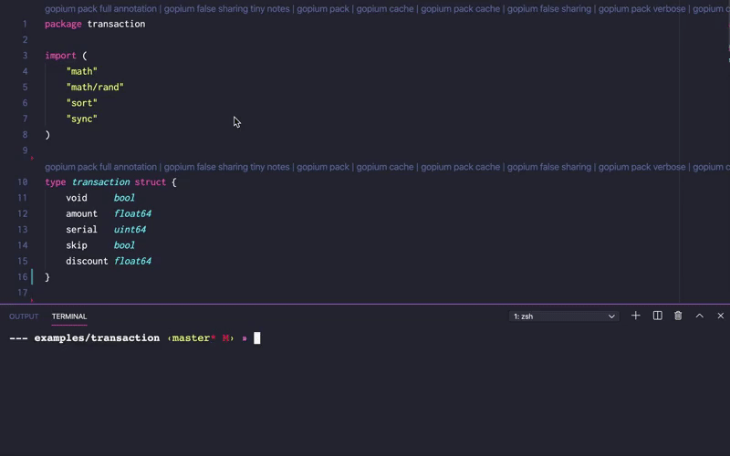

<p align="center">
    
</p>

# Gopium 🌺: Smart Go Structures Optimizer and Manager

[](https://github.com/1pkg/gopium/actions?query=workflow%3Alint+branch%3Amaster+)
[](https://github.com/1pkg/gopium/actions?query=workflow%3Abuild+branch%3Amaster+)
[](https://github.com/1pkg/gopium/actions?query=workflow%3Atest+branch%3Amaster+)
[](https://goreportcard.com/report/github.com/1pkg/gopium)
[](https://github.com/1pkg/gopium/blob/master/go.mod)
[](LICENSE)

## Introduction

Gopium is the tool that was designed to automate and simplify common structs performance and optimization transformations and fields management.

## Features

- Gopium provides numbers of common transformations for structs, such as: cpu cache alignment, memory packing, false sharing guarding, (`cache_rounding_cpu_l1_discrete`, `memory_pack`, `false_sharing_cpu_l1`, [and more](#strategies-and-transformations)).
- All Gopium transformations could be combined together to build optimal actions for your specific code and needs.

```bash
gopium walker package strategy_1 strategy_2 strategy_3 ...
```

- All Gopium transformations results and artifacts could be differently formatted and routed to multiple outputs, among which are: direct overwriting or copying to go (code) ast, multiple options for code formatting and printing, comparison tables for results, common textual data serialization formats, (`ast_go`, `ast_go_tree`, `ast_gopium`, `size_align_file_md_table`, [and more](#walkers-and-formatters)).
- Gopium has rich vscode extension to provide better experience for usage and simplify interactions with tool, [see more](extensions/vscode/README.MD).
  
- Gopium supports target configs variety, in case if you need optimizations for specific platform or hardware, such as: target compiler, target architecture, target cpu cache lines sizes, [and more](#options-and-flags).
- Gopium has optional go structs tag literals to keep and reproduce gopium transformations inside your code base, also tags are intended to be used as structs fields grouping mechanism if you need to apply different transformation to different fields groups inside one structure, [see more](#gopium-and-tags).

## Requirements Installation and Usage

Gopium uses go1.22, but it's most likely gonna work with other versions too.  
Note that Gopium is heavily relying on [types](https://golang.org/pkg/go/types/) and [ast](https://golang.org/pkg/go/ast/) packages, and these packages might be slightly different among major go releases.

To install Gopium VSCode Extension use [vscode marketplace](https://marketplace.visualstudio.com/items?itemName=1pkg.gopium).

To install and update Gopium CLI use:

```bash
go install github.com/1pkg/gopium@latest
```

In order to use gopium cli you need to provide at least package name (full package name is expected), list of strategies which is applied one by one and single walker.
Outcome of execution is fully defined by list of strategies and walker combination.
List of strategies modifies structs inside the package, walker facilitates and insures, that outcome is formatted written to one of provided destinations.

Gopium CLI uses next parameters schema:

```bash
gopium -flag_0 -flag_n walker package strategy_1 strategy_2 strategy_3 ...
```

where:

- walker defines destination for execution outcome, it should contain one value from [full walkers list](#walkers-and-formatters).
- package defines target package name for execution, note that full package name is expected.
- strategies [1..n] define transformations list that should be applied to package, they should contain at least one values from [full transformations list](#strategies-and-transformations).
- flags [0..n] define modificators for transfromations and walker, see [full flags list](#options-and-flags).

Basic Gopium CLI usage commands examples:

```bash
# exec transformations against all structs starting A inside 1pkg/gopium/gopium package
# and print results formatted as json array to standart output
gopium -r ^A go_std 1pkg/gopium/gopium filter_pads memory_pack separate_padding_cpu_l1_top separate_padding_cpu_l1_bottom
```

```bash
# exec transformations against all structs inside gopium package
# at /alternative/go/path/src/ path and write results back directly to go files
gopium ast_go gopium memory_pack -p /alternative/go/path/src/{{package}}
```

```bash
# exec transformations against all structs inside 1pkg/gopium/gopium package
# with target arm architecture and preset cache lines 8,8,8
# and write results to go package 1pkg/gopium/gopium copy
gopium -a arm -l 8 8 8 ast_go_tree 1pkg/gopium/gopium false_sharing_cpu_l1
```

Real Gopium CLI commands examples that have been used to create [examples](examples):

```bash
###
# creates new folder `transaction_gopium` inside /Users/1pkg/proj/src/1pkg/gopium/examples/
#
# with all inside structures transformed with:
# - rearrange structure fields in order to get optimal memory layout
# - add structure comment size annotation
# - add gopium tags to structure to save this list of transformation
# (it saves just list of transformation inside the tags and doesn't affect previous transformation at all, this way this list of strategies could be reused later)
# (force means override gopium tags even if previous exist)
#
# -p defines full path to package `1pkg/gopium/examples/transaction`
# it could be omitted if full package name would be used instead `gopium ast_go_tree 1pkg/gopium/examples/transaction memory_pack ...`
###
gopium ast_go_tree transaction memory_pack struct_annotate_comment add_tag_group_force -p /Users/1pkg/proj/src/1pkg/gopium/examples/transaction
```

```bash
###
# creates new folder `transaction_gopium` inside /Users/1pkg/proj/src/1pkg/gopium/examples/
#
# with all structures transformed with:
# - filter explicit fields paddings
# - add cache line #1 false sharing paddings after each field
# - add structure comment size annotation
# - add gopium tags to structure to save this list of transformation
# (it saves just list of transformation inside the tags and doesn't affect previous transformation at all, this way this list of strategies could be reused later)
# (force means override gopium tags even if previous exist)
#
# -p defines full path to package `1pkg/gopium/examples/transaction`
# it could be omitted if full package name would be used instead `gopium ast_go_tree 1pkg/gopium/examples/transaction memory_pack ...`
###
gopium ast_go_tree transaction filter_pads false_sharing_cpu_l1 add_tag_group_force -p /Users/1pkg/proj/src/1pkg/gopium/examples/transaction
```

```bash
###
# creates new folder `transaction_gopium` inside /Users/1pkg/proj/src/1pkg/gopium/examples/
#
# with all structures transformed to:
# - filter explicit fields paddings
# - add explicit system alignment padding after each field
# - add explicit padding in the end of structure to round its size to cache line #1
# - add structure comment size annotation
# - add gopium tags to structure to save this list of transformation
# (it saves just list of transformation inside the tags and doesn't affect previous transformation at all, this way this list of strategies could be reused later)
# (force means override gopium tags even if previous exist)
#
# -p defines full path to package `1pkg/gopium/examples/transaction`
# it could be omitted if full package name would be used instead `gopium ast_go_tree 1pkg/gopium/examples/transaction memory_pack ...`
#
# -l -l -l defines cache lines #1 #2 #3 sizes that are used for transformations
###
gopium -l 64 -l 64 -l 64 ast_go_tree transaction filter_pads explicit_paddings_system_alignment cache_rounding_cpu_l1_discrete struct_annotate_comment add_tag_group_force -p /Users/1pkg/proj/src/1pkg/gopium/examples/transaction
```

## Examples Benchmarks and Docs

```bash
# goversion: go1.13
# goos: darwin
# goarch: amd64
```

**simple business transaction aggregator (no trasformations)**

```go
// pkg: 1pkg/gopium/examples/transaction
// BenchmarkCompress-8 16 98752864 ns/op 230 B/op 3 allocs/op
// no trasformations

// transaction defines business transaction
type transaction struct {
	void     bool
	amount   float64
	serial   uint64
	skip     bool
	discount float64
} // struct size: 26 bytes; struct align: 8 bytes; struct aligned size: 40 bytes; struct ptr scan size: 0 bytes; - 🌺 gopium @1pkg

// aggregate defines compressed set of transactions
type aggregate struct {
	total float64
} // struct size: 8 bytes; struct align: 8 bytes; struct aligned size: 8 bytes; struct ptr scan size: 0 bytes; - 🌺 gopium @1pkg
```

**simple business transaction aggregator (`gopium -r transaction ast_go_tree 1pkg/gopium/examples/transaction memory_pack`)**

```go
// pkg: 1pkg/gopium/examples/memory_pack/transaction
// BenchmarkCompress-8 19 83438394 ns/op 254 B/op 3 allocs/op
// 18.3% ns/op faster | 10.5% B/op bigger

// transaction defines business transaction
type transaction struct {
	amount   float64 `gopium:"memory_pack,struct_annotate_comment,add_tag_group_force"`
	serial   uint64  `gopium:"memory_pack,struct_annotate_comment,add_tag_group_force"`
	discount float64 `gopium:"memory_pack,struct_annotate_comment,add_tag_group_force"`
	void     bool    `gopium:"memory_pack,struct_annotate_comment,add_tag_group_force"`
	skip     bool    `gopium:"memory_pack,struct_annotate_comment,add_tag_group_force"`
} // struct size: 26 bytes; struct align: 8 bytes; struct aligned size: 32 bytes; struct ptr scan size: 0 bytes; - 🌺 gopium @1pkg

// aggregate defines compressed set of transactions
type aggregate struct {
	total float64
} // struct size: 8 bytes; struct align: 8 bytes; struct aligned size: 8 bytes; struct ptr scan size: 0 bytes; - 🌺 gopium @1pkg
```

**simple business transaction aggregator (`gopium -r aggregate ast_go_tree 1pkg/gopium/examples/transaction filter_pads false_sharing_cpu_l1`)**

```go
// pkg: 1pkg/gopium/examples/false_sharing_cpu_l1/transaction
// BenchmarkCompress-8 20 84066847 ns/op 336 B/o 3 allocs/op
// 17.5% ns/op faster | 46.1% B/op bigger

// transaction defines business transaction
type transaction struct {
	void     bool
	amount   float64
	serial   uint64
	skip     bool
	discount float64
} // struct size: 26 bytes; struct align: 8 bytes; struct aligned size: 40 bytes; struct ptr scan size: 0 bytes; - 🌺 gopium @1pkg

// aggregate defines compressed set of transactions
type aggregate struct {
	total float64  `gopium:"filter_pads,false_sharing_cpu_l1,struct_annotate_comment,add_tag_group_force"`
	_     [56]byte `gopium:"filter_pads,false_sharing_cpu_l1,struct_annotate_comment,add_tag_group_force"`
} // struct size: 64 bytes; struct align: 8 bytes; struct aligned size: 64 bytes; struct ptr scan size: 0 bytes; - 🌺 gopium @1pkg
```

**simple business transaction aggregator (`gopium ast_go_tree 1pkg/gopium/examples/transaction filter_pads explicit_paddings_system_alignment cache_rounding_cpu_l1_discrete`)**

```go
// pkg: 1pkg/gopium/examples/cache_rounding_cpu_l1_discrete/transaction
// BenchmarkCompress-8 13 130450557 ns/op 209 B/op 3 allocs/op
// 32.1% ns/op slower | 10.5% B/op lower

// transaction defines business transaction
type transaction struct {
	void     bool     `gopium:"filter_pads,explicit_paddings_system_alignment,cache_rounding_cpu_l1_discrete,struct_annotate_comment,add_tag_group_force"`
	_        [7]byte  `gopium:"filter_pads,explicit_paddings_system_alignment,cache_rounding_cpu_l1_discrete,struct_annotate_comment,add_tag_group_force"`
	amount   float64  `gopium:"filter_pads,explicit_paddings_system_alignment,cache_rounding_cpu_l1_discrete,struct_annotate_comment,add_tag_group_force"`
	serial   uint64   `gopium:"filter_pads,explicit_paddings_system_alignment,cache_rounding_cpu_l1_discrete,struct_annotate_comment,add_tag_group_force"`
	skip     bool     `gopium:"filter_pads,explicit_paddings_system_alignment,cache_rounding_cpu_l1_discrete,struct_annotate_comment,add_tag_group_force"`
	_        [7]byte  `gopium:"filter_pads,explicit_paddings_system_alignment,cache_rounding_cpu_l1_discrete,struct_annotate_comment,add_tag_group_force"`
	discount float64  `gopium:"filter_pads,explicit_paddings_system_alignment,cache_rounding_cpu_l1_discrete,struct_annotate_comment,add_tag_group_force"`
	_        [24]byte `gopium:"filter_pads,explicit_paddings_system_alignment,cache_rounding_cpu_l1_discrete,struct_annotate_comment,add_tag_group_force"`
} // struct size: 64 bytes; struct align: 8 bytes; struct aligned size: 64 bytes; struct ptr scan size: 0 bytes; - 🌺 gopium @1pkg

// aggregate defines compressed set of transactions
type aggregate struct {
	total float64 `gopium:"filter_pads,explicit_paddings_system_alignment,cache_rounding_cpu_l1_discrete,struct_annotate_comment,add_tag_group_force"`
} // struct size: 8 bytes; struct align: 8 bytes; struct aligned size: 8 bytes; struct ptr scan size: 0 bytes; - 🌺 gopium @1pkg
```

See [examples](examples) and [godoc](https://pkg.go.dev/github.com/1pkg/gopium?tab=doc) for more examples, benchmarks details and godoc.  
Gopium is inspired by this [paper](https://www.usenix.org/legacy/publications/library/proceedings/als00/2000papers/papers/full_papers/sears/sears_html/index.html), inside you can find list of techniques that Gopium tries to automate.

## Gopium CLI

Gopium CLI is the cobra cli tool that was designed to automate and simplify some common performance transformations for structs, such as:

- cpu cache alignment
- memory packing
- false sharing guarding
- auto annotation
- generic fields management, etc.

In order to use gopium cli you need to provide at least package name (full package name is expected), list of strategies which is applied one by one and single walker.
Outcome of execution is fully defined by list of strategies and walker combination.
List of strategies modifies structs inside the package, walker facilitates and insures, that outcome is formatted written to one of provided destinations.

Gopium CLI uses next parameters schema:

```bash
gopium -flag_0 -flag_n walker package strategy_1 strategy_2 strategy_3 ...
```

where:

- walker defines destination for execution outcome, it should contain one value from [full walkers list](#walkers-and-formatters).
- package defines target package name for execution, note that full package name is expected.
- strategies [1..n] define transformations list that should be applied to package, they should contain at least one values from [full transformations list](#strategies-and-transformations).
- flags [0..n] define modificators for transfromations and walker, see [full flags list](#options-and-flags).

Real Gopium CLI commands examples that have been used to create [examples](examples):

```bash
###
# creates new folder `transaction_gopium` inside /Users/1pkg/proj/src/1pkg/gopium/examples/
#
# with all inside structures transformed with:
# - rearrange structure fields in order to get optimal memory layout
# - add structure comment size annotation
# - add gopium tags to structure to save this list of transformation
# (it saves just list of transformation inside the tags and doesn't affect previous transformation at all, this way this list of strategies could be reused later)
# (force means override gopium tags even if previous exist)
#
# -p defines full path to package `1pkg/gopium/examples/transaction`
# it could be omitted if full package name would be used instead `gopium ast_go_tree 1pkg/gopium/examples/transaction memory_pack ...`
###
gopium ast_go_tree transaction memory_pack struct_annotate_comment add_tag_group_force -p /Users/1pkg/proj/src/1pkg/gopium/examples/transaction
```

```bash
###
# creates new folder `transaction_gopium` inside /Users/1pkg/proj/src/1pkg/gopium/examples/
#
# with all structures transformed with:
# - filter explicit fields paddings
# - add cache line #1 false sharing paddings after each field
# - add structure comment size annotation
# - add gopium tags to structure to save this list of transformation
# (it saves just list of transformation inside the tags and doesn't affect previous transformation at all, this way this list of strategies could be reused later)
# (force means override gopium tags even if previous exist)
#
# -p defines full path to package `1pkg/gopium/examples/transaction`
# it could be omitted if full package name would be used instead `gopium ast_go_tree 1pkg/gopium/examples/transaction memory_pack ...`
###
gopium ast_go_tree transaction filter_pads false_sharing_cpu_l1 add_tag_group_force -p /Users/1pkg/proj/src/1pkg/gopium/examples/transaction
```

```bash
###
# creates new folder `transaction_gopium` inside /Users/1pkg/proj/src/1pkg/gopium/examples/
#
# with all structures transformed to:
# - filter explicit fields paddings
# - add explicit system alignment padding after each field
# - add explicit padding in the end of structure to round its size to cache line #1
# - add structure comment size annotation
# - add gopium tags to structure to save this list of transformation
# (it saves just list of transformation inside the tags and doesn't affect previous transformation at all, this way this list of strategies could be reused later)
# (force means override gopium tags even if previous exist)
#
# -p defines full path to package `1pkg/gopium/examples/transaction`
# it could be omitted if full package name would be used instead `gopium ast_go_tree 1pkg/gopium/examples/transaction memory_pack ...`
#
# -l -l -l defines cache lines #1 #2 #3 sizes that are used for transformations
###
gopium -l 64 -l 64 -l 64 ast_go_tree transaction filter_pads explicit_paddings_system_alignment cache_rounding_cpu_l1_discrete struct_annotate_comment add_tag_group_force -p /Users/1pkg/proj/src/1pkg/gopium/examples/transaction
```

Gopium also has rich vscode extension to provide better experience for usage and simplify interactions with cli tool, [see more](extensions/vscode/README.MD).

## Walkers and Formatters

Gopium provides next walkers:

- ast_go (directly syncs result as go code to orinal file)
- ast_go_tree (directly syncs result as go code to copy package)
- ast_std (prints result as go code to stdout)
- ast_gopium (directly syncs result as go code to copy gopium files)
- file_json (prints json encoded results to single file inside package directory)
- file_xml (prints xml encoded results to single file inside package directory)
- file_csv (prints csv encoded results to single file inside package directory)
- file_md_table (prints markdown table encoded results to single file inside package directory)
- size_align_file_md_table (prints markdown encoded table of sizes and aligns difference for results to single file inside package directory)
- fields_file_html_table (prints html encoded table of fields difference for results to single file inside package directory)

## Strategies and Transformations

Gopium provides next strategies:

- process_tag_group (uses gopium fields tags annotation in order to process different set of strategies on different groups and then combine results in single struct result)
- memory_pack (rearranges structure fields to obtain optimal memory utilization)
- memory_unpack (rearranges structure field list to obtain inflated memory utilization)
- cache_rounding_cpu_l1_discrete (fits structure into cpu cache line #1 by adding bottom partial rounding cpu cache padding)
- cache_rounding_cpu_l2_discrete (fits structure into cpu cache line #2 by adding bottom partial rounding cpu cache padding)
- cache_rounding_cpu_l3_discrete (fits structure into cpu cache line #3 by adding bottom partial rounding cpu cache padding)
- cache_rounding_bytes\_{{uint}}\_discrete (fits structure into provided number of bytes by adding bottom partial rounding bytes cache padding)
- cache_rounding_cpu_l1_full (fits structure into full cpu cache line #1 by adding bottom rounding cpu cache padding)
- cache_rounding_cpu_l2_full (fits structure into full cpu cache line #2 by adding bottom rounding cpu cache padding)
- cache_rounding_cpu_l3_full (fits structure into full cpu cache line #3 by adding bottom rounding cpu cache padding)
- cache_rounding_bytes\_{{uint}}\_full (fits structure into full provided number of bytes by adding bottom rounding bytes cache padding)
- false_sharing_cpu_l1 (guards structure from false sharing by adding extra cpu cache line #1 paddings for each structure field)
- false_sharing_cpu_l2 (guards structure from false sharing by adding extra cpu cache line #1 paddings for each structure field)
- false_sharing_cpu_l3 (guards structure from false sharing by adding extra cpu cache line #1 paddings for each structure field)
- false_sharing_bytes\_{{uint}} (guards structure from false sharing by adding extra provided number of bytes paddings for each structure field)
- separate_padding_system_alignment_top (separates structure with extra system alignment padding by adding the padding at the top)
- separate_padding_system_alignment_bottom (separates structure with extra system alignment padding by adding the padding at the bottom)
- separate_padding_cpu_l1_top (separates structure with extra cpu cache line #1 padding by adding the padding at the top)
- separate_padding_cpu_l2_top (separates structure with extra cpu cache line #2 padding by adding the padding at the top)
- separate_padding_cpu_l3_top (separates structure with extra cpu cache line #3 padding by adding the padding at the top)
- separate_padding_bytes\_{{uint}\_top (separates structure with extra provided number of bytes padding by adding the padding at the top)
- separate_padding_cpu_l1_bottom (separates structure with extra cpu cache line #1 padding by adding the padding at the bottom)
- separate_padding_cpu_l2_bottom (separates structure with extra cpu cache line #2 padding by adding the padding at the bottom)
- separate_padding_cpu_l3_bottom (separates structure with extra cpu cache line #3 padding by adding the padding at the bottom)
- separate_padding_bytes\_{{uint}\_bottom (separates structure with extra provided number of bytes padding by adding the padding at the bottom)
- explicit_paddings_system_alignment (explicitly aligns each structure field to system alignment padding by adding missing paddings for each field)
- explicit_paddings_type_natural (explicitly aligns each structure field to max type alignment padding by adding missing paddings for each field)
- add_tag_group_soft (adds gopium fields tags annotation if no previous annotation found)
- add_tag_group_force (adds gopium fields tags annotation if previous annotation found overwrites it)
- add_tag_group_discrete (discretely adds gopium fields tags annotation if no previous annotation found)
- add_tag_group_force_discrete (discretely adds gopium fields tags annotation if previous annotation found overwrites it)
- remove_tag_group (removes gopium fields tags annotation)
- fields_annotate_doc (adds align, size and ptr size doc annotation for each structure field)
- fields_annotate_comment (adds align, size and ptr size comment annotation for each structure field)
- struct_annotate_doc (adds aggregated align, size and ptr scan size doc annotation for structure)
- struct_annotate_comment (adds aggregated align, size and ptr scan size comment annotation for structure)
- name_lexicographical_ascending (sorts fields accordingly to their names in ascending order)
- name_lexicographical_descending (sorts fields accordingly to their names descending order)
- type_lexicographical_ascending (sorts fields accordingly to their types in ascending order)
- type_lexicographical_descending (sorts fields accordingly to their types in descending order)
- filter_pads (filters out all structure padding fields)
- ignore (does nothing by returning original structure)

## Gopium and Tags

Gopium CLI usues structure fields tags strategies for two purposes:

- save transformations list for later reuse
- to have abillity to apply different strategies groups inside one structure

For example by applying `gopium -l 64 -l 128 ast_stg transaction process_tag_group` to:

```go
// transaction defines business transaction
type transaction struct {
	amount   float64 `gopium:"group:critical;filter_pads,false_sharing_cpu_l1,separate_padding_cpu_l2_bottom"`
	serial   uint64  `gopium:"group:other;memory_pack"`
	discount float64 `gopium:"group:critical;filter_pads,false_sharing_cpu_l1,separate_padding_cpu_l2_bottom"`
	void     bool    `gopium:"group:other;memory_pack"`
	skip     bool    `gopium:"group:other;memory_pack"`
}
```

we can expect next Gopium CLI groups result:

```go
// transaction defines business transaction
type transaction struct {
        amount   float64 `gopium:"group:critical;filter_pads,false_sharing_cpu_l1,separate_padding_cpu_l2_bottom"`
        _        [56]byte
        discount float64 `gopium:"group:critical;filter_pads,false_sharing_cpu_l1,separate_padding_cpu_l2_bottom"`
        _        [56]byte
        _        [64]byte
        serial   uint64 `gopium:"group:other;memory_pack"`
        void     bool   `gopium:"group:other;memory_pack"`
        skip     bool   `gopium:"group:other;memory_pack"`
}
```

In this example fields `amount` and `discount` (group `critical`) were processed independently from fields `serial`, `void`, `skip` (group `other`) and two different sets of transformations were applied to each of them.

## Additional Notes

- it might be useful to use filter_pads in pipes with other strategies to clean paddings first.
- process_tag_group currently supports only next fields tags annotation formats:
  - gopium:"stg,stg,stg" processed as default group
  - gopium:"group:def;stg,stg,stg" processed as named group
- by specifying tag_type you can automatically generate fields tags annotation suitable for process_tag_group.
- `add_tag_*` strategies just add list of applied transformations to structure fields tags and NOT change results of other strategies, you can execute `process_tag_group` strategy afterwards to reuse saved strategies list.

## Options and Flags

|              Full              | Short |   Type   |     Default     | Description                                                                                                                                                                                                                                        |
| :----------------------------: | :---: | :------: | :-------------: | -------------------------------------------------------------------------------------------------------------------------------------------------------------------------------------------------------------------------------------------------- |
|       --target_compiler        |  -c   |  string  |       gc        | Gopium target platform compiler, possible values are: gc or gccgo.                                                                                                                                                                                 |
|     --target_architecture      |  -a   |  string  |      amd64      | Gopium target platform architecture, possible values are: 386, arm, arm64, amd64, mips, etc.                                                                                                                                                       |
| --target_cpu_cache_lines_sizes |  -l   |  []int   |  [64, 64, 64]   | Gopium target platform CPU cache line sizes in bytes, cache line size is set one by one l1,l2,l3,... For now only 3 lines of cache are supported by strategies.                                                                                    |
|         --package_path         |  -p   |  string  | src/{{package}} | Gopium go package path, either relative or absolute path to root of the package is expected. To obtain full path from relative, package path is concatenated with current GOPATH env var. Template {{package}} part is replaced with package name. |
|      --package_build_envs      |  -e   | []string |       [ ]       | Gopium go package build envs, additional list of building envs is expected.                                                                                                                                                                        |
|     --package_build_flags      |  -f   | []string |       [ ]       | Gopium go package build flags, additional list of building flags is expected.                                                                                                                                                                      |
|        --walker_regexp         |  -r   |  string  |       .\*       | Gopium walker regexp, regexp that defines which structures are subjects for visiting. Visiting is done only if structure name matches the regexp.                                                                                                  |
|         --walker_deep          |  -d   |   bool   |      true       | Gopium walker deep flag, flag that defines type of nested scopes visiting. By default it visits all nested scopes.                                                                                                                                 |
|        --walker_backref        |  -b   |   bool   |      true       | Gopium walker backref flag, flag that defines type of names referencing. By default any previous visited types have affect on future relevant visits.                                                                                              |
|        --printer_indent        |  -i   |   int    |        0        | Gopium printer width of tab, defines the least code indent.                                                                                                                                                                                        |
|      --printer_tab_width       |  -w   |   int    |        8        | Gopium printer width of tab, defines width of tab in spaces for printer.                                                                                                                                                                           |
|      --printer_use_space       |  -s   |   bool   |      false      | Gopium printer use space flag, flag that defines if all formatting should be done by spaces.                                                                                                                                                       |
|      --printer_use_gofmt       |  -g   |   bool   |      true       | Gopium printer use gofmt flag, flag that defines if canonical gofmt tool should be used for formatting. By default it is used and overrides other printer formatting parameters.                                                                   |
|           --timeout            |  -t   |   int    |        0        | Gopium global timeout of cli command in seconds, considered only if value greater than 0.                                                                                                                                                          |

## Licence

Gopium is licensed under the MIT License.  
See [LICENSE](LICENSE) for the full license text.
